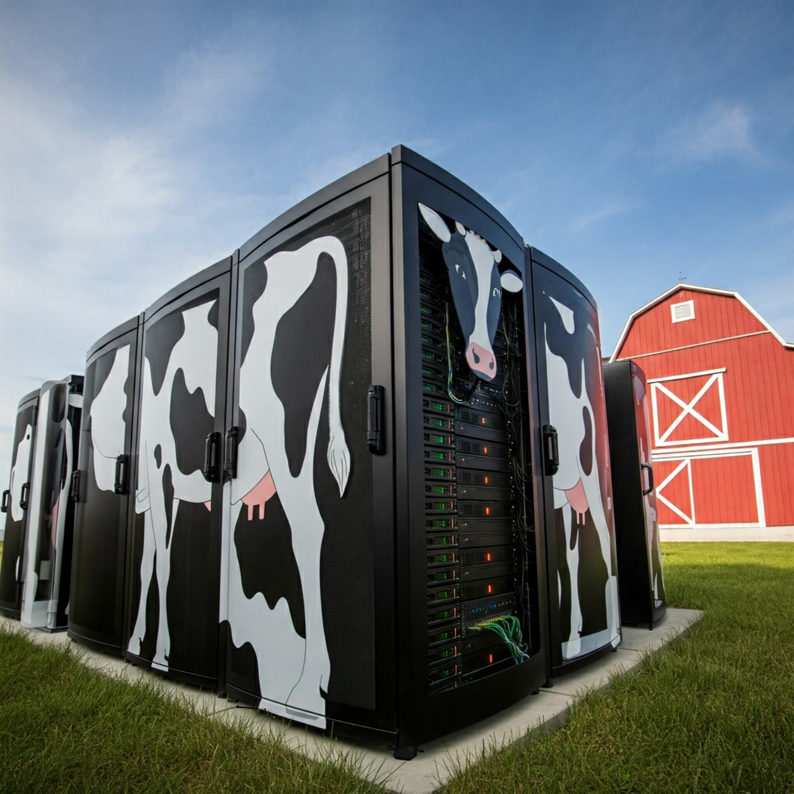

# From Pets to Cattle: Embracing Immutable Infrastructure in the Cloud Era

## The Rise of the "Cattle" Model

The shift to cloud computing has fundamentally changed how we manage infrastructure and even how we measure success.  Where "uptime" was once the gold standard, signifying the continuous operation of individual servers, the cloud era prioritizes "availability." This reflects a move from the "pet" model of meticulously maintaining individual servers to the "cattle" model of treating them as interchangeable units within a vast herd.  This transition marks the rise of immutable infrastructure, where servers are replaced rather than modified, eliminating configuration drift and maximizing availability. Imagine a farm where a sick cow is simply replaced with a healthy one from the herd – that's the essence of immutability and the key to maintaining continuous service. 

## Advantages of Immutability

This approach brings significant advantages.  Immutable infrastructure simplifies deployments, enhances scalability, and improves fault tolerance. If a server fails, its replacement is ready to go, minimizing downtime and ensuring consistent performance.  It's like having a readily available backup for every server, but instead of restoring data, you simply spin up a new, identical instance. This focus on rapid replacement ensures that the service remains available even when individual components fail.

## Immutability and DevOps

Immutable infrastructure is also a cornerstone of DevOps practices. By treating servers as disposable, we can automate deployments, scale effortlessly, and recover quickly from failures.  This frees us from the burden of manual server management, allowing us to focus on delivering value to users.  Furthermore, immutability promotes consistency and predictability, reducing the risk of errors caused by unique server configurations.

## Embracing the Shift

In the cloud era, embracing the "cattle" model and prioritizing availability is crucial for organizations seeking agility and efficiency.  It requires a shift in mindset, letting go of attachment to individual servers and embracing the power of managing them as a collective. While this transition may seem challenging, the benefits of increased reliability, scalability, and automation make it a necessity for thriving in today's dynamic technological landscape.